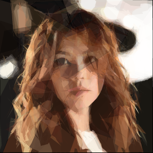
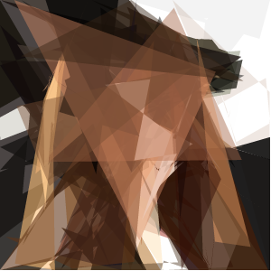
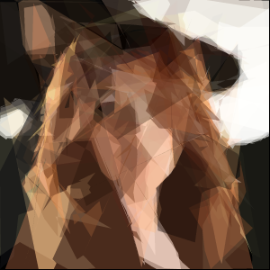
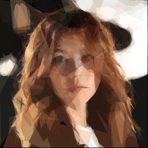

# polygons_image
使用多边形绘制图像

程序效果
>受到Chrome浏览器同源策略的影响，该网页要在火狐浏览器上打开

**Chrome**

**GEM.邓紫棋**

对于简单的图像，程序能在很短的时间内使用多边形绘制出一个比较像的图像，但是对于复杂的，那只能是等一会了，一般要好几个小时。

其实自己实现了一遍代码，最后发现其中最难的，或者说获得时间最多的并不是理解其中的原理以及敲代码，而是能够使用适当的参数保证程序能够尽快的得出自己满意的结果，我大部分时间都在调参数了o(╥﹏╥)o

原理详细分析见[博客](http://blog.csdn.net/u014271114/article/details/54908129)